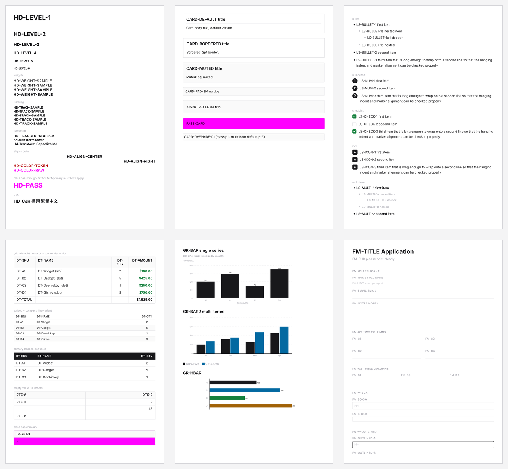
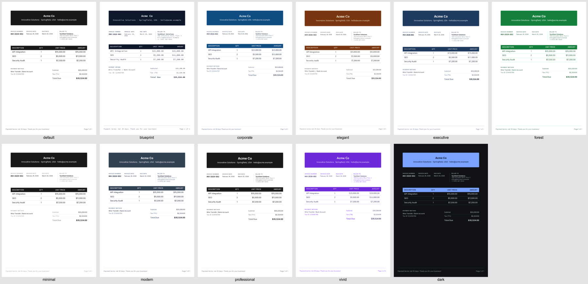
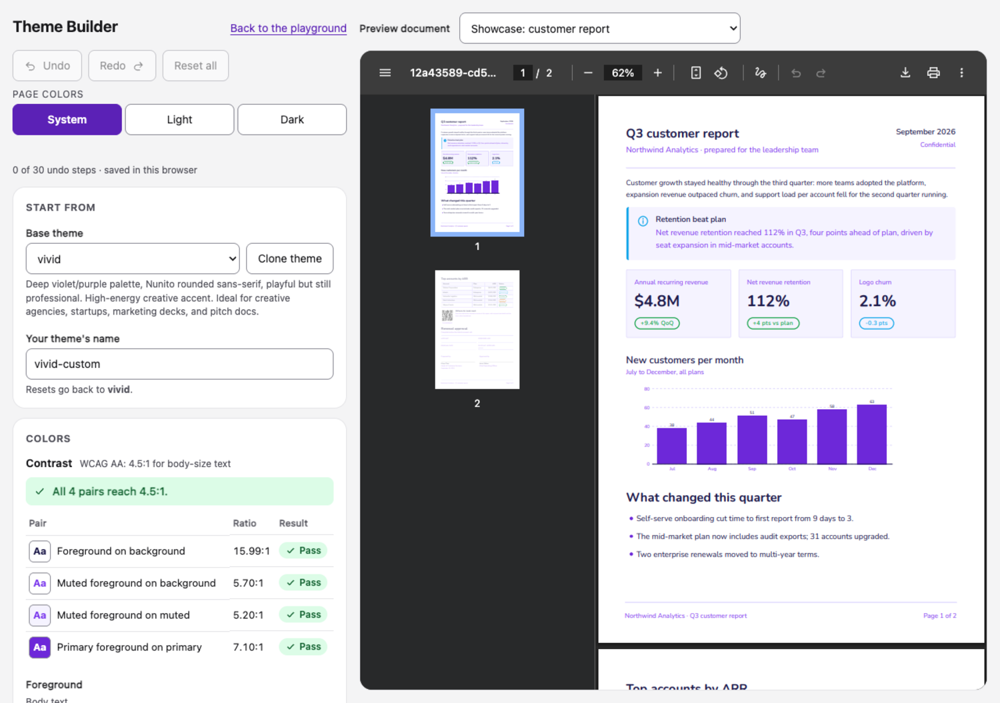
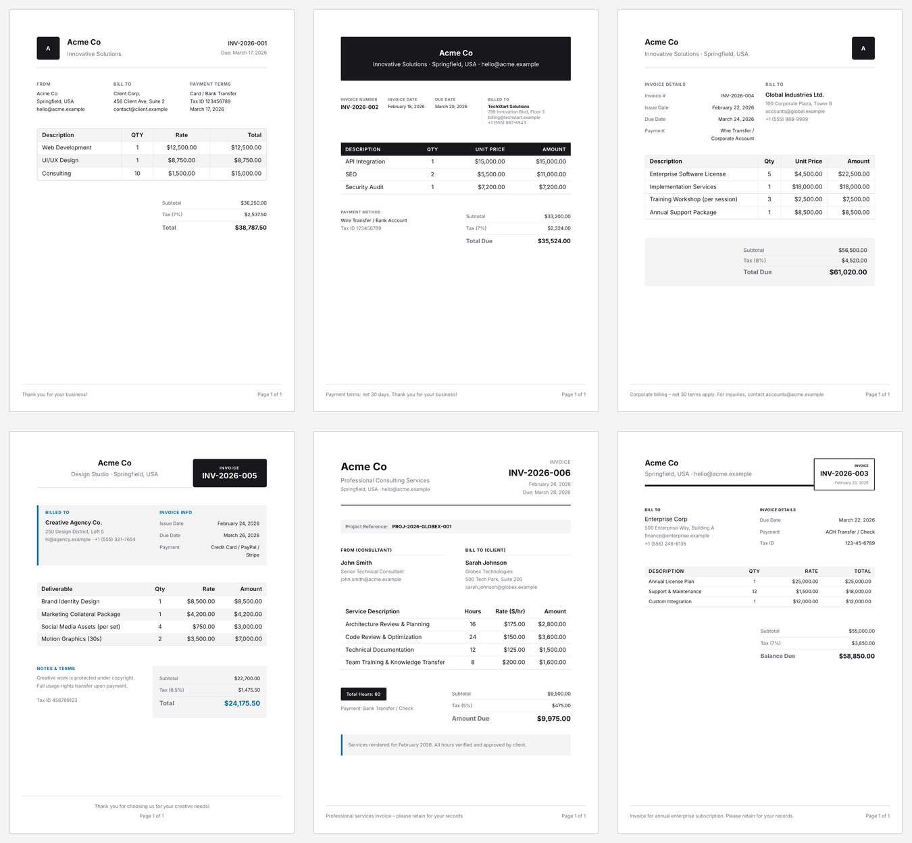
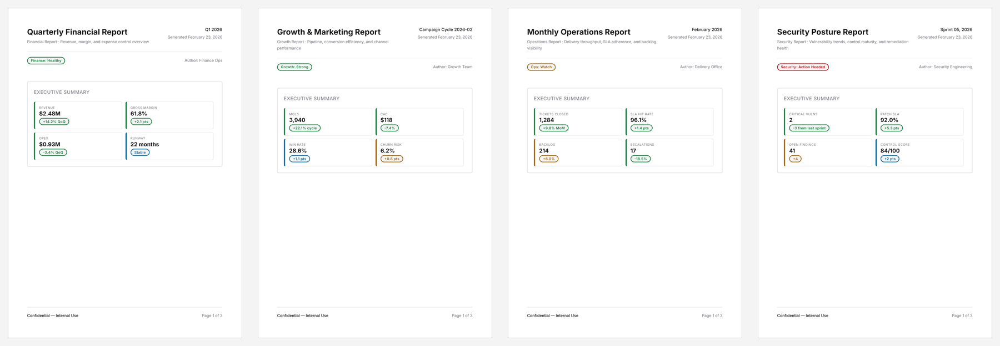
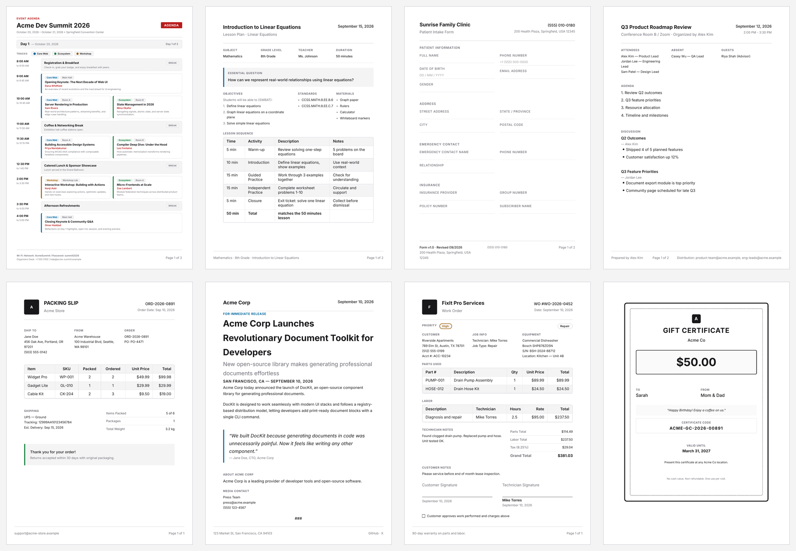
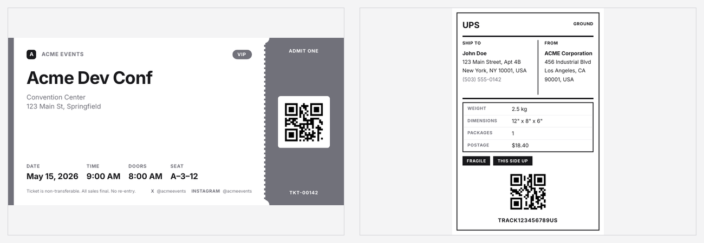
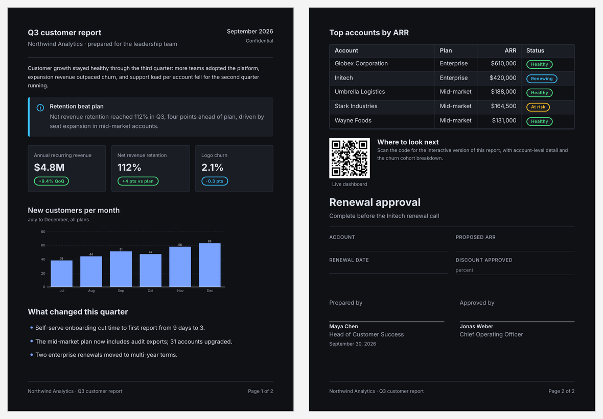

# pdfwind

Vue components in, paged PDFs out — in Node or the browser, without a headless browser.

  



## Why pdfwind?

- **Vue 3 + Tailwind v4**: compose documents with semantic colors like `bg-primary` and `text-muted-foreground`.
- **24 components (29 exports including the Table parts)** and **20 blocks** for invoices, reports, forms, tickets and more.
- **Takumi PDFs with selectable text**: the same document components render in Node and the browser, with pagination and repeating headers/footers.
- **11 runtime-switchable themes** and a live **Theme Builder** with WCAG contrast feedback and CSS export/import.

**Inspired by [pdfcn](https://github.com/shadcn-labs/pdfcn), the React equivalent, and [PDFx](https://github.com/akii09/pdfx).** pdfcn's MIT designs, props, theme values and chart math are ported to Vue; PDFx is inspiration only, with no copied code. See [THIRD_PARTY_NOTICES](THIRD_PARTY_NOTICES.md).

## Status and scope

**Alpha 0.1.0 — not published to npm.** Clone and install a local tarball; the package remains private. **Vue only**, not React. There is **no hosted demo**; run the playground locally.
The components are Vue SFCs: use a Vite-like bundler with the Vue plugin, `?raw`, `?url` and `import.meta.glob`. Ordinary Node cannot import `.vue` files; the Node example below uses Vite SSR.

## Use with Vue / Node

Requires **Node 22.12+**. From a clone, pack the library, then install it in a separate project:

```sh
git clone https://github.com/Ray0907/pdfwind.git
cd pdfwind
pnpm install
npm pack --pack-destination /tmp
mkdir -p /tmp/readme-consumer && cd /tmp/readme-consumer
npm init -y
npm pkg set type=module
npm install ../pdfwind-0.1.0.tgz vue
npm install -D vite @vitejs/plugin-vue
```

Save this as **`vite.config.js`** (used by both examples):

```js
import vue from "@vitejs/plugin-vue";
export default {
  plugins: [vue()],
  optimizeDeps: { exclude: ["pdfwind", "takumi-pdf"], include: ["pdfwind > qrcode"] },
  ssr: { noExternal: ["pdfwind"] },
};
```

**Node:** save as **`node.mjs`**, then run `node node.mjs` to write `invoice.pdf`:

```js
import { createServer } from "vite";
import { readFile, writeFile } from "node:fs/promises";
import { renderPdf } from "pdfwind/node";
const vite = await createServer({ server: { middlewareMode: true, ws: false }, appType: "custom" });
try {
  const { InvoiceModern, InvoiceFooter, blockPage } = await vite.ssrLoadModule("pdfwind");
  await writeFile("invoice.pdf", await renderPdf(InvoiceModern, {}, { ...blockPage, footer: InvoiceFooter, theme: "vivid" }));
} finally { await vite.close(); }
```

**Browser:** save as **`App.vue`**:

```vue
<script setup>
import { PdfPreview, InvoiceModern, InvoiceFooter, blockPage } from "pdfwind/browser";
const options = { ...blockPage, footer: InvoiceFooter, theme: "vivid" };
</script>
<template><div style="height:90vh"><PdfPreview :component="InvoiceModern" :options="options" /></div></template>
```

Save `main.js` as `import { createApp } from "vue"; import App from "./App.vue"; createApp(App).mount("#app");` and `index.html` as `<!doctype html><html lang="en"><head><meta charset="UTF-8"><title>pdfwind</title></head><body><div id="app"></div><script type="module" src="/main.js"></script></body></html>`. Run `npx vite` for development or `npx vite build` for a production bundle.
For Nuxt server rendering and a client-only preview, see the [Nuxt example and setup notes](examples/nuxt/README.md).

## Gallery





<details>
<summary>More PDFs: reports, other blocks, small formats and dark paper</summary>






</details>

## Themes and Theme Builder

Choose `default`, `blueprint`, `corporate`, `elegant`, `executive`, `forest`, `minimal`, `modern`, `professional`, `vivid` or `dark` via the `theme` option, as in the examples above. Unknown names throw an error listing valid themes. Fonts load lazily; pdfcn's base-14 names map **Helvetica → Inter**, **Times-Roman → Lora**, **Courier → Source Code Pro**.

Run `pnpm dev` in the clone and open `http://localhost:5173/?view=builder`. Edit colors, fonts, sizes, gaps and margins with live contrast feedback, undo/redo, and CSS import/export. Contrast feedback is not a guarantee that every theme meets WCAG.
Download `theme.css`, put it beside `node.mjs`, and add this **inside its `try` block**, after loading the components:

```js
const themeCss = await readFile("theme.css", "utf8");
await writeFile("custom.pdf", await renderPdf(InvoiceModern, {}, { ...blockPage, footer: InvoiceFooter, theme: "vivid", themeCss }));
```

In Vite, use `import themeCss from "./theme.css?raw"` and pass it in `options`; bundled CSS is also exported, e.g. `pdfwind/theme-css/vivid?raw`. Re-import exported CSS into the Builder to continue editing. Exported margin variables are advisory: pass `margin` explicitly when rendering.

## Limitations

- **Not browser CSS:** individual `rotate` utilities are ignored (use `transform`); text `opacity` can clip glyphs; one-sided dashed/dotted borders need SVG; transparent repeating gradients can leave artifacts; fixed-position elements reserve no layout space. See [technical notes and known gaps](docs/development/PROGRESS.md#phase-2a-14-layout--text-components).
- **Fonts:** bundled Latin fonts and Noto Sans TC cover the examples, not all writing systems. Supply covering custom fonts for Hangul, emoji or Arabic; font coverage alone does not guarantee shaping/layout support.
- **Preview:** replacing a PDF resets the viewer's scroll position to page 1. Node SFC loading requires Vite SSR, as above.
- **First-render download:** the built playground measured **~5.1 MB English / ~10.5 MB Chinese**, including **~4.1 MB WASM** (decimal MB). Fresh Chromium contexts, plain HTTP without compression, CDP transferred bytes including response headers and HTML/JS/CSS/preloads; excludes in-memory PDF blobs. These are playground measurements, not a fixed library cost; details are generated in `out/static/report.md` by `pnpm e2e:static`.
- **Hosting/CI:** no hosted demo. [Workflow files](.github/workflows) exist, but GitHub Actions/Pages have not been run or enabled by this preparation.

## For LLMs and agents

[llms.txt](llms.txt) — reference index.
[llms-full.txt](llms-full.txt) — component/block props, rendering options, themes and runnable examples.

## Development

```sh
pnpm install
pnpm dev
pnpm check       # tokens, offline docs links/anchors, generated llms staleness
pnpm test        # offline/headless E2Es; explicit SKIP for network-only checks
pnpm test:all    # adds public comparisons, Nuxt and packed consumer; needs network
```

Use pnpm 10; E2Es need Poppler, ImageMagick and the lockfile-matching Playwright Chromium. Setup, coverage and reports: [CONTRIBUTING](CONTRIBUTING.md).

## Credits and licence

[MIT](LICENSE). [pdfcn](https://github.com/shadcn-labs/pdfcn) by shadcn-labs supplies the ported design; [PDFx](https://github.com/akii09/pdfx) by akii09 inspired the project. Bundled fonts use SIL OFL; see [full notices](THIRD_PARTY_NOTICES.md).
[Contribute](CONTRIBUTING.md) · [Code of conduct](CODE_OF_CONDUCT.md) · [Report a vulnerability privately](SECURITY.md).
